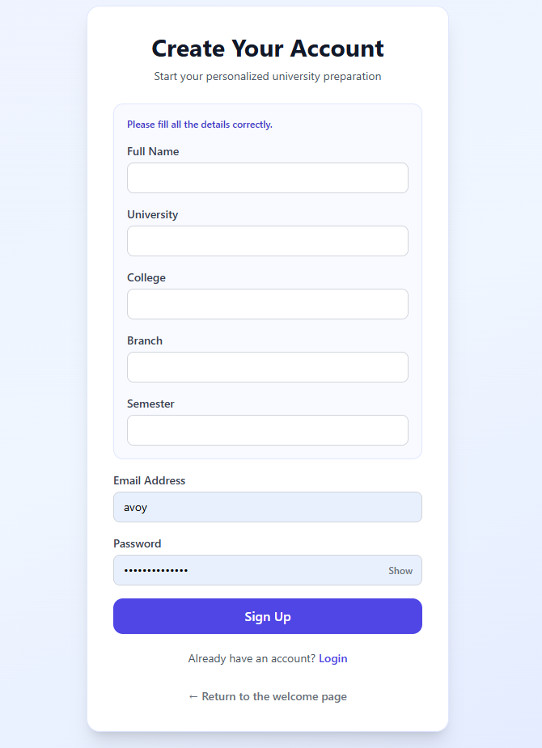
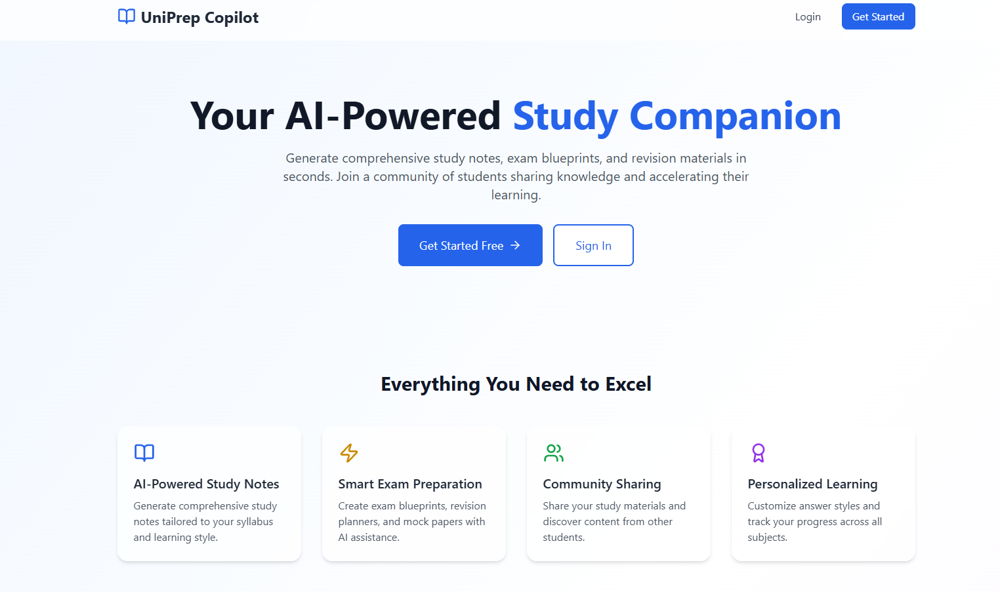
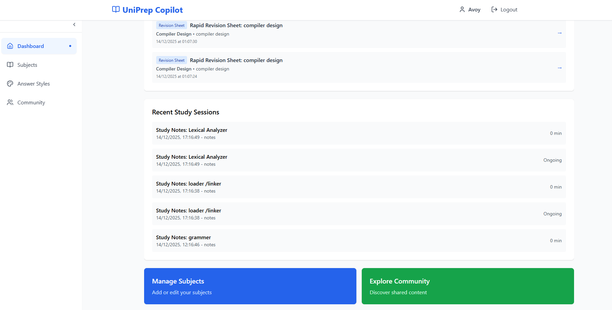
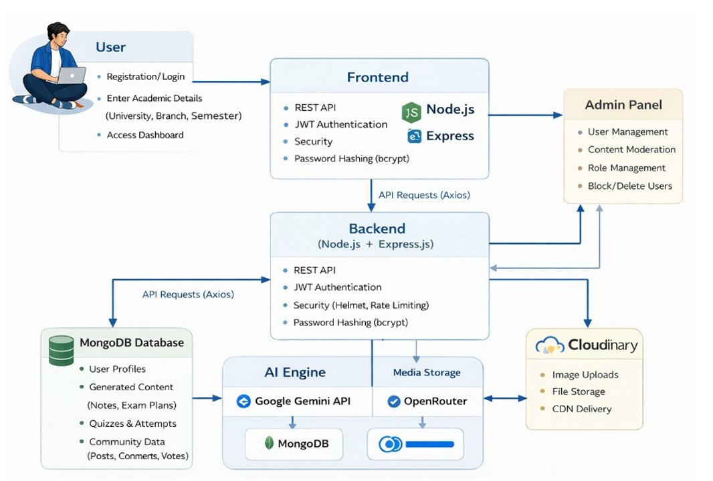

<div align="center">


# Academic Help Buddy

**The AI-powered academic platform that transforms how students learn, prepare, and succeed.**

<br/>

<!-- Tech Stack Badges -->


<br/>

[](https://react.dev/)
[](https://expressjs.com/)
[](https://www.mongodb.com/atlas)
[](https://nodejs.org/)
[](https://vitejs.dev/)
[](https://tailwindcss.com/)
[](https://cloudinary.com/)
[](https://vercel.com/)
[](https://render.com/)

<br/>

[Live Demo](#) &nbsp;&nbsp;|&nbsp;&nbsp; [Backend Docs](./backend/README.md) &nbsp;&nbsp;|&nbsp;&nbsp; [Frontend Docs](./frontend/README.md) &nbsp;&nbsp;|&nbsp;&nbsp; [Report a Bug](#) &nbsp;&nbsp;|&nbsp;&nbsp; [Request a Feature](#)

</div>

---

## Demo

<!-- Replace YOUR_VIDEO_ID with your actual YouTube video ID -->
<div align="center">
  <a href="https://www.youtube.com/watch?v=sMn2lGWTmPs" target="_blank">
    
  </a>
  <br/>
  <sub>Click to watch the demo on YouTube</sub>
</div>

<br/>

### Screenshots

<table>
  <tr>
    <td align="center">
      
      <sub><b>Sign Up</b></sub>
    </td>
    <td align="center">
      
      <sub><b>Home</b></sub>
    </td>
    <td align="center">
      
      <sub><b>Dashboard</b></sub>
    </td>
  </tr>
</table>

---

## Overview

<div align="center">
  
  <br/>
  <sub>System Architecture & Methodology</sub>
</div>

<br/>

**Academic Help Buddy** is a full-stack, AI-powered academic assistant built for students who want to study smarter. It transforms raw syllabi, lecture notes, and uploaded documents into structured study notes, quizzes, mock exam papers, and personalised revision plans — all powered by state-of-the-art large language models via OpenRouter.

---

## Table of Contents

- [Demo](#demo)
- [Features](#features)
- [Technology Stack](#technology-stack)
- [Repository Structure](#repository-structure)
- [Getting Started](#getting-started)
- [Environment Configuration](#environment-configuration)
- [Running Locally](#running-locally)
- [Deployment](#deployment)
- [API Reference](#api-reference)
- [Contributing](#contributing)
- [License](#license)

---

## Features

<table>
<tr>
<td valign="top" width="50%">

**AI-Powered Content Generation**
- Generate structured study notes from topics, syllabi, or uploaded documents
- Create formatted reports and presentation outlines
- Customisable output styles to control tone, depth, and formatting

**Exam Preparation Suite**
- Exam Blueprints — AI-generated breakdown of expected question distribution by topic
- Revision Planners — personalised daily and weekly schedules based on exam dates
- Rapid Revision Sheets — condensed, high-yield material for last-minute review
- Mock Papers — full-length practice papers generated from your subject content

**Quizzes and Self-Assessment**
- AI-generated quizzes per subject with configurable difficulty
- Attempt tracking with analytics and performance trends over time

</td>
<td valign="top" width="50%">

**Document Context System**
- Upload PDFs, lecture slides, and notes to build per-subject context
- AI reads uploaded documents to generate more relevant, personalised content

**Community**
- Share study materials, notes, and resources with other students
- Browse, upvote, comment on, and clone posts from the community feed
- Report inappropriate content for moderation

**Study Session Tracking**
- Start and end timed study sessions per subject
- Track cumulative study time and frequency across subjects

**File Management**
- Upload images, PDFs, videos, audio, and documents to Cloudinary
- Automatic image compression via Sharp (WebP, 40-60% size reduction)
- Per-file-type size limits with MIME type whitelisting

</td>
</tr>
</table>

---

## Technology Stack

| Layer | Technology | Purpose |
|---|---|---|
| Frontend Framework | React 19 + Vite 7 | UI rendering and fast production builds |
| Styling | Tailwind CSS v3 | Utility-first responsive design |
| State Management | Zustand | Lightweight global client state |
| Client Routing | React Router DOM v7 | Client-side navigation |
| Data Visualisation | Recharts | Analytics and progress charts |
| Backend Framework | Express.js v5 | REST API and business logic |
| Runtime | Node.js v22+ | Server-side JavaScript execution |
| Database | MongoDB Atlas + Mongoose | Document store and ODM |
| Authentication | JWT (Access + Refresh Tokens) | Stateless, secure auth |
| AI Orchestration | OpenRouter SDK — Google Gemini | LLM routing and content generation |
| File Processing | Multer + Sharp | Upload handling and image compression |
| File Storage | Cloudinary | CDN-backed media management |
| Rate Limiting | express-rate-limit | API abuse protection |
| Frontend Deployment | Vercel | Edge CDN hosting and SPA rewrites |
| Backend Deployment | Render | Managed Node.js hosting |

---

## Repository Structure

```
project/
├── backend/
│   └── src/
│       ├── config/          # Database and Cloudinary configuration
│       ├── controllers/     # Route handlers for all API domains
│       ├── middleware/      # JWT authentication middleware
│       ├── models/          # Mongoose schemas and data models
│       ├── routes/          # Express route definitions
│       ├── services/        # AI orchestration and external API integrations
│       ├── utils/           # Shared utility functions
│       └── server.js        # Application entry point
│   ├── .env.sample
│   ├── package.json
│   └── README.md
│
├── frontend/
│   ├── public/              # Static assets
│   └── src/
│       ├── components/      # Reusable UI components
│       ├── pages/           # Page-level components (11 pages)
│       ├── services/        # Axios API client with token refresh logic
│       ├── store/           # Zustand state management
│       ├── App.jsx          # Root component and route declarations
│       ├── main.jsx         # Application entry point
│       └── index.css        # Global styles
│   ├── .env.sample
│   ├── vite.config.js
│   ├── vercel.json          # SPA routing rewrites and asset caching rules
│   └── package.json
│
├── .gitignore
└── README.md
```

---

## Getting Started

### Prerequisites

| Requirement | Version | Notes |
|---|---|---|
| Node.js | v18 or higher | Required for both frontend and backend |
| npm | v9 or higher | Package manager |
| MongoDB | Any | Local instance or MongoDB Atlas cluster |
| Cloudinary Account | — | Required for file storage |
| OpenRouter API Key | — | Required for AI model access |

### Installation

```bash
# Clone the repository
git clone https://github.com/your-username/Academic-AI-Assistant.git
cd Academic-AI-Assistant/project

# Install backend dependencies
cd backend
npm install

# Install frontend dependencies
cd ../frontend
npm install
```

---

## Environment Configuration

Both the backend and frontend require environment variables to run. A `.env.sample` file is provided in each directory as a reference template.

### Backend — `backend/.env`

```env
PORT=7000
NODE_ENV=development
MONGO_URI=mongodb+srv://<user>:<password>@<cluster>.mongodb.net/<dbname>

JWT_SECRET=your-access-token-secret
JWT_REFRESH_SECRET=your-refresh-token-secret
JWT_ACCESS_EXPIRES_IN=15m
JWT_REFRESH_EXPIRES_IN=7d

OPENROUTER_API_KEY=sk-or-v1-...
OPENROUTER_BASE_URL=https://openrouter.ai/api/v1
OPENROUTER_MODEL=google/gemini-3-flash-preview

CLOUDINARY_CLOUD_NAME=your-cloud-name
CLOUDINARY_API_KEY=your-api-key
CLOUDINARY_API_SECRET=your-api-secret

BACKEND_URL=http://localhost:7000
FRONTEND_URL=http://localhost:3000
```

### Frontend — `frontend/.env`

```env
VITE_API_URL=http://localhost:7000/api
```

Refer to [backend/README.md](./backend/README.md) and [frontend/README.md](./frontend/README.md) for the full variable reference and descriptions.

---

## Running Locally

Open two terminals and start both servers:

**Terminal 1 — Backend**
```bash
cd backend
npm run dev
# Server runs at http://localhost:7000
```

**Terminal 2 — Frontend**
```bash
cd frontend
npm run dev
# Application opens at http://localhost:3000
```

The frontend at `http://localhost:3000` communicates with the backend at `http://localhost:7000`.

---

## Deployment

### Backend — Render

1. Create a new **Web Service** on [Render](https://render.com)
2. Set the **root directory** to `backend`
3. Set the **build command** to `npm install` and **start command** to `npm start`
4. Add all environment variables from `backend/.env` to the Render environment dashboard
5. Set `FRONTEND_URL` to your deployed Vercel URL

### Frontend — Vercel

1. Connect the repository to [Vercel](https://vercel.com)
2. Set the **root directory** to `frontend`
3. Add the environment variable:
   ```
   VITE_API_URL=https://<your-render-service>.onrender.com/api
   ```
4. Deploy — Vercel runs `npm run build` automatically and serves the output

The `vercel.json` file handles SPA routing rewrites and static asset caching automatically.

---

## API Reference

The backend exposes a RESTful API at `/api`. All protected routes require a valid JWT access token in the `Authorization` header.

| Route Group | Base Path | Description |
|---|---|---|
| Authentication | `/api/auth` | Register, login, token refresh, current user |
| Users | `/api/users` | Profile management and progress tracking |
| Subjects | `/api/subjects` | Subject CRUD operations |
| Content | `/api/content` | AI-generated notes, reports, and presentations |
| Context | `/api/context` | Document upload and subject context management |
| Exam Tools | `/api/exam` | Blueprints, planners, revision sheets, mock papers |
| Quizzes | `/api/quiz` | Quiz generation, attempts, and analytics |
| Sessions | `/api/sessions` | Study session tracking |
| Styles | `/api/styles` | Output style configuration |
| Community | `/api/community` | Posts, comments, votes, cloning, and reporting |
| File Upload | `/api/cloudinary` | File upload, deletion, and configuration status |
| Admin | `/api/admin` | Administrative endpoints |

For the complete endpoint reference including methods, parameters, request/response shapes, and authentication requirements, see [backend/README.md](./backend/README.md).

---

## Contributing

Contributions are welcome. Please follow the process below:

1. Fork the repository
2. Create a feature branch: `git checkout -b feature/your-feature-name`
3. Commit your changes using conventional commit messages: `feat:`, `fix:`, `docs:`, `chore:`
4. Push to your branch: `git push origin feature/your-feature-name`
5. Open a Pull Request describing the change and linking any relevant issues

---

## License

This project is MIT Licensed.

---

<div align="center">
  <sub>Academic Help Buddy &mdash; Built to help students learn smarter.</sub>
</div>